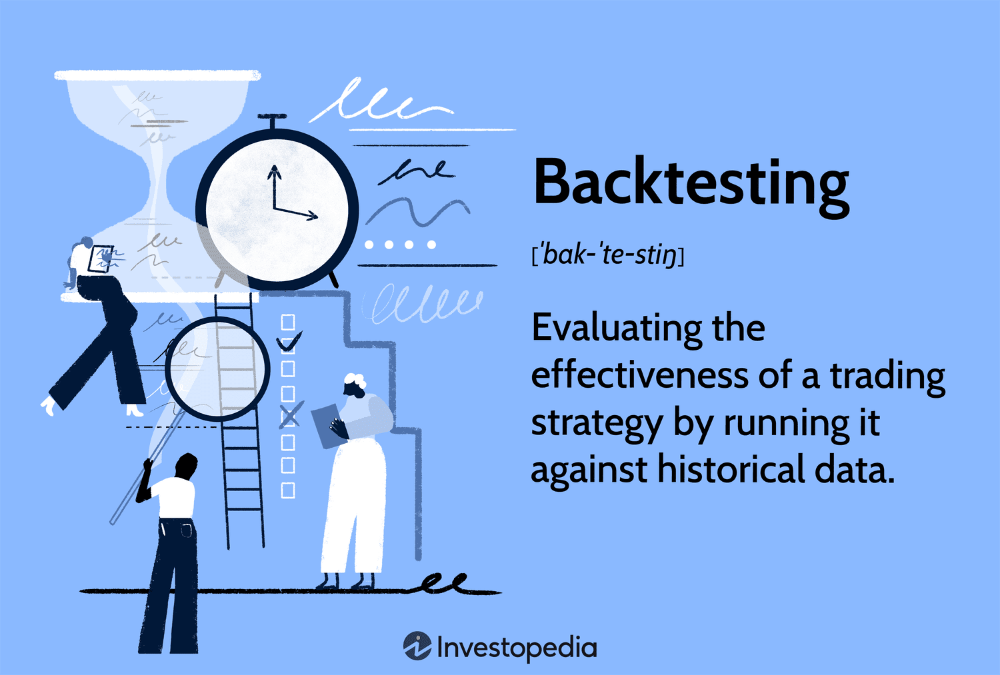

# TSMC (2330) Golden Cross and Death Cross Trading Strategy Backtest


_Image credit: Investopedia_

### 🎯 Using historical data from TSMC (2330) for the past year to backtest the Golden Cross and Death Cross trading strategy.

The strategy logic is simple: buy the asset when the short-term moving average crosses above the long-term moving average (Golden Cross), and hold it until the short-term moving average crosses below the long-term moving average (Death Cross), where you sell the asset.

📺 [Watch the tutorial on YouTube](https://youtu.be/R8N3dSC8iM8) 🎥

## Disclaimer

This script is for educational purposes only and does not constitute investment advice. Additionally, past backtesting results cannot guarantee future trading performance.

## Backtesting Steps:

1. **Retrieve historical data**
2. **Organize the data**
3. **Execute strategy logic**
4. **Evaluate the results**

---

### 1. Retrieve Historical Data 📈

We use the `yfinance` library to download historical data for TSMC (2330.TW) from July 23, 2023, to July 24, 2024.

```python
import yfinance as yf
data = yf.download('2330.TW', start='2023-07-23', end='2024-07-24')
```

### 2. Organize the Data 🛠️

We calculate the 5-day and 20-day Simple Moving Averages (SMA) and use these values to implement the Golden Cross and Death Cross logic.

```python
data['sma_5'] = data['Close'].rolling(window=5).mean()
data['sma_20'] = data['Close'].rolling(window=20).mean()
data['prev_sma_5'] = data['sma_5'].shift(1)
data['prev_sma_20'] = data['sma_20'].shift(1)
```

### 3. Execute Strategy Logic 🚀

We simulate trades based on the Golden Cross and Death Cross signals, buying and selling the asset whenever the crossovers occur.

```python
buy_list = []
sell_list = []
# Detailed code omitted...
```

### 4. Evaluate the Results 📊

We calculate the win rate and total return of the strategy, comparing it to a “buy and hold” strategy.

```python
win_rate = len(df[df['return_rate'] > 0]) / len(df)
strategy_return_rate = df['return_rate'].sum()
buy_and_hold_return_rate = (data['Open'].iloc[-1] - data['Open'].iloc[0]) / data['Open'].iloc[0]
```

## Results and Analysis

- **Win rate:** win_rate
- **Strategy return rate:** strategy_return_rate
- **Buy and hold return rate:** buy_and_hold_return_rate
